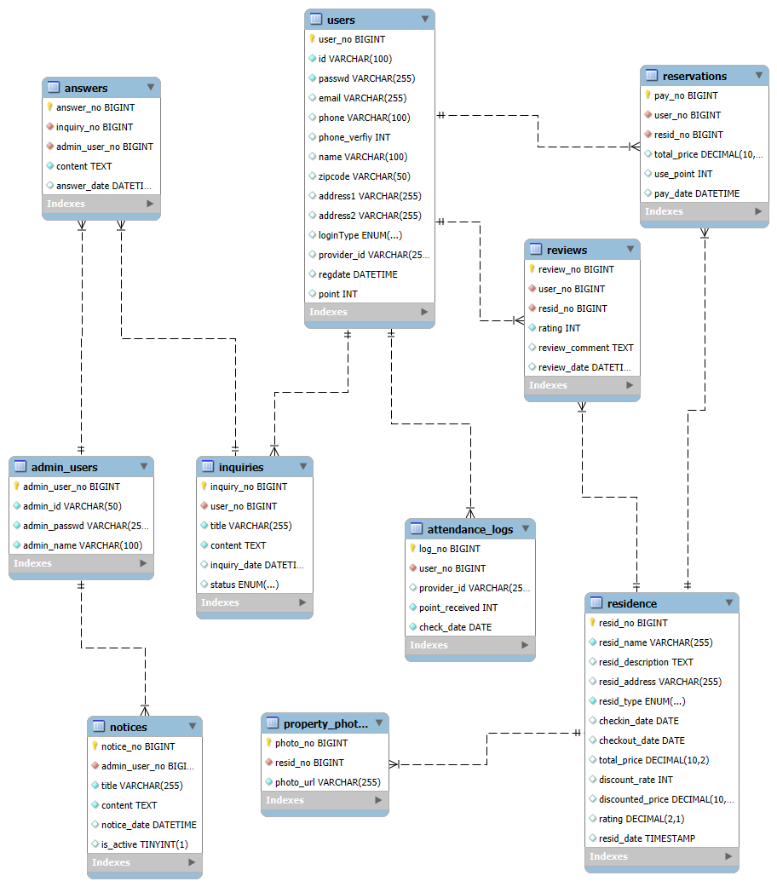

# 2Team Final Project

## 프로그램 소개 
+ 오늘어때

## 프로그램 라이브러리

### Java
+ Java Version: 17

### Spring Boot
+ Spring Boot Version: 3.4.0
+ Spring Boot Starter Dependencies
+ Spring Boot Logging: 3.4.0
+ Spring Boot Data JPA: 3.4.0
+ Spring Boot DevTools: 3.4.0
+ Spring Boot Security: 3.4.0
+ Spring Boot Thymeleaf: 3.4.0
+ Spring Boot Web: 3.4.0
+ Spring Boot WebFlux: 3.4.0
+ Spring Boot WebSocket: 3.4.0
+ Spring Boot JDBC: 3.4.0
+ Spring Boot Actuator: 3.4.0
+ Spring Boot OAuth2 Client: 3.4.0

### Spring Retry
+ Version: 1.3.1

### AspectJ
+ Version: 1.9.9

### JSON and Jackson
+ Jackson XML: 2.15.0 (from transitive dependencies)
+ Jackson Databind: 2.15.0 (from transitive dependencies)
+ JSON (org.json): 20240303

### MyBatis
+ MyBatis Spring Boot Starter: 3.0.3
+ MyBatis Spring Boot Starter Test: 3.0.3

### Lombok
+ Lombok: Latest (from Gradle dependency resolution)

### Timefold Solver
+ Version: 1.15.0

### Thymeleaf
+ Thymeleaf Layout Dialect: Latest (transitive resolution)
+ Thymeleaf Extras Spring Security 6: Latest (transitive resolution)

### MySQL
+ MySQL Connector/J: Latest (runtime-only dependency)

### JAXB (Jakarta Binding API)
+ Jakarta XML Bind API: 3.0.0
+ JAXB Runtime: 3.0.0

### JUnit and Testing
+ JUnit Platform Launcher: Latest
+ Spring Boot Starter Test: 3.4.0
+ Spring Security Test: 3.4.0

### Servlet API
+ Servlet API: 4.0.1
+ Spring Security Web: 6.0.0
+ Spring Security Config: 6.0.0

### 네이버
+ 지도, 소셜로그인 API

### 카카오
+ 지도, 소셜로그인 API

### 공공데이터 포털
+ 기상청, 일몰/일출 API

### 아이콘
+ Rian Maulana - Flaticon

## DataBase ERD
+ 

